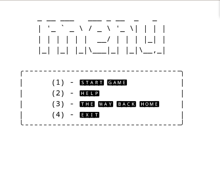

# STAR TREK - QUIZ
## Game Quiz sobre as series de star trek feito em rust

### O game consiste em 10 perguntas sobre as  series:

* Série Original
* The Next Generation
* Deep Space Nine
* Voyager
* Enterprise


### Pontuação

Cada pergunta vale 1 ponto.

Acertos:

*  \>= 9 -> Um verdadeiro tripulante 🖖
* \>= 7 -> Fã 🏅
* \>= 5 -> Deixei passando na TV 📺
*  < 5  -> Confundiu com Star Wars ? 🙃

# Instalação

### Para poder jogar é necessário o uso do cargo ou rustc
> Instalação do cargo em Linux e MacOS

```bash 
    curl https://sh.rustup.rs -sSf | sh
```

> Clonar repositório, compilar e executar game
```bash 
    git clone git@github.com:matheusdefariaa/StarTrek-Quiz.git
    cd StarTrek-Quiz/
    cargo build --release && cargo run
```

# Imagens



